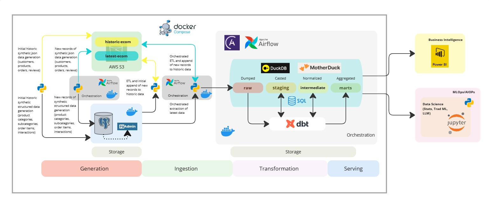

## Migrate from Snowflake to DuckDB and MotherDuck: A Guide for an eCommerce End-to-End Data Engineering Pipeline

### Introduction
When my Snowflake 30-day trial expired shortly after publishing Build an End-to-End Data Engineering Pipeline for eCommerce with a Modern Data Stack, I decided to migrate from Snowflake to DuckDB for development and MotherDuck for production. This article focuses solely on the migration process. For details on the initial setup, refer to the original article.

### Overview

### **1. Data Generation**

The data flow begins with two parallel streams of synthetic data generation:

**Historical Synthetic Data Generation (Initial Load):**

- **JSON Data**: Customers, products, orders, and reviews data are generated in JSON format and stored in AWS S3.
- **Structured Data**: Product categories, subcategories, order items, and interaction data are generated in a structured format and stored in **Postgres** (managed via pgAdmin on Docker).

**Latest (30-day) Synthetic Data Generation (Ongoing Operations):**

- **JSON Data**: Customers, products, orders, and reviews data are generated in JSON format and stored in AWS S3.
- **Structured Data**: Product categories, subcategories, order items, and interaction data are generated in a structured format and stored in **Postgres** (managed via pgAdmin on Docker).

### **2. Data Ingestion**

- **JSON Data from S3**: Apache Airflow orchestrates the **ETL (Extract, Transform, Load)** process, appending new JSON records from S3 to historical data, and loading them to the historical data in S3 and DuckDB and MotherDuck raw schema.
- **Structured Data from Postgres**: Airflow also orchestrates the **ETL** process, appending new structured records from Postgres to historical data, and loading to the historical data in S3 and DuckDB and MotherDuck raw schema.

### **3. Data Transformation**

The ingested data is processed with dbt (data build tool) and stored in DuckDB and MotherDuck through different layers:

- **Raw Layer**: Data is first dumped in its raw form.
- **Staging Layer**: Data is casted into appropriate data types and formats.
- **Intermediate Layer**: Data is normalized to remove redundancy and ensure consistency.
- **Marts Layer**: Data is aggregated and structured into data marts for specific business use cases.

### **4. Orchestration**

- Orchestrates the latest (last 30 days) synthetic data generation and ingestion
- Orchestrates the transformations across the DuckDB and MotherDuck layers, ensuring proper lineage and documentation.

### **5. Data Serving (Next Project)**

The processed and aggregated data is served to different downstream systems:

- **Business Intelligence**: Aggregated data marts are consumed by Power BI for reporting and dashboards.
- **Data Science**: Processed data is used in Jupyter Notebooks for machine learning, statistics, and AI operations.

See resources:
- [Demo video]()
- [Documentation](https://medium.com/@sclauguico/migrate-from-snowflake-to-duckdb-and-motherduck-a-guide-for-an-ecommerce-end-to-end-data-41fadae1da1b)

This project has been inspired by:
- Data Engineering Zoomcamp
- DeepLearning.AI AWS Data Engineering Professional Certificate
- IBM Data Engineering
- Joe Reis' teachings
- Jayzern's dbt-Airflow-Snowflake implementation
- Madyar Marat's Heart rate stream DE project
- Wynne Lo's Airflow and Astro article
